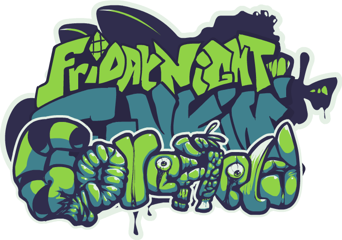

# Gorefield READ ME!!

This is a cool Friday Night Funkin' mod based on all things gorefield! Alot is heavly insipired of lumpy touch's animations!

DOWNLOADS:
- GAMEBANNA: [https://gamebanana.com/mods/501201](https://gamebanana.com/mods/501201)
- GAMEJOLT: [https://gamejolt.com/games/gorefieldv2/883364](https://gamejolt.com/games/gorefieldv2/883364)

# STUFF IN MOD
- Play against many creepy versions of gorefield...
- Fight against shape shifting gods!
- Epic songs (made by lovely and talented composers)
- Around 20 Polished Songs!
- Cutscenes for story mode and some weeks.
- Codes Menu and TV (Have fun getting codes)
- And easter eggs??

# ENGINE???
This mod is made on a extensible modding framework for fnf: Codename engine.
This source code folder can be placed in the mods folder to be played in codename!

Download Codename:
- Windows: [https://tinyurl.com/cne-download-windows](https://tinyurl.com/cne-download-windows)
- Mac OS: [https://tinyurl.com/cne-download-macos](https://tinyurl.com/cne-download-macos)
- Linux: [https://tinyurl.com/cne-download-linux](https://tinyurl.com/cne-download-linux)

Codename's Github: [https://github.com/FNF-CNE-Devs/CodenameEngine](https://github.com/FNF-CNE-Devs/CodenameEngine)

Little note, gorefield builds on gamebanna/gamejolt come with a exe built in!!
